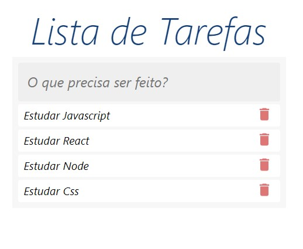
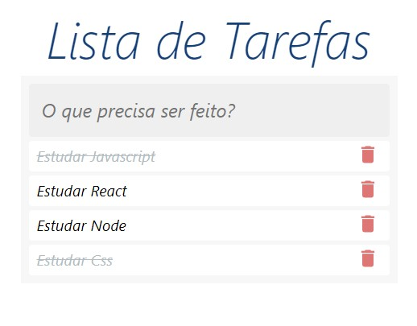

[![Contributors][contributors-shield]][contributors-url]
[![Forks][forks-shield]][forks-url]
[![Stargazers][stars-shield]][stars-url]
[![Issues][issues-shield]][issues-url]
[![MIT License][license-shield]][license-url]
[![LinkedIn][linkedin-shield]][linkedin-url]

<h3 align="center">Projetos Estudo</h3>

<!-- TABLE OF CONTENTS -->

  
Conteúdo

  <ol>
    <li>
      <a href="#Sobre-o-projeto">Sobre o Projeto</a>
    </li>
   <li><a href="#Tecnologias">Tecnologias</a></li>
    <li><a href="#Branches">Branches</a></li>
    <li><a href="#contatos">Contatos</a></li>
    <li><a href="#Agradecimentos">Agradecimentos</a></li>
  </ol>

<!-- ABOUT THE PROJECT -->

## Sobre o Projeto

Projeto criado para aprendizagem da linguagem Typescript, seguindo aulas da plataforma DevSamurai.
Com o intuito de aprendizado não foram feitas modificações nas funcionalidades além do que foi apresentado no treinamento.
O intuito do projeto é criar uma lista de tarefas onde o usuário pode adicionar, excluir ou marcar a tarefa como finalizada.

<h4>Lista de Tarefas</h4>
Lista de Tarefas

 
<h4>Lista com tarefas Finalizadas</h4>
Tela com tarefas finalizadas

(<a href="#top">back to top</a>)

## Tecnologias

<!-- CONTACT -->

## Contatos

Marcos Araujo - [@linkedIn](https://www.linkedin.com/in/marcosaraujosouza/) - marcos.araso@hotmail.com

Project Link: [https://github.com/marcosaraujo-dev/Cgs.Lista_Tarefas](https://github.com/marcosaraujo-dev/Cgs.Lista_Tarefas)

(<a href="#top">back to top</a>)

<!-- ACKNOWLEDGMENTS -->

## Agradecimentos

-   [DevSamurai](https://class.devsamurai.com.br/)

(<a href="#top">back to top</a>)

<!-- MARKDOWN LINKS & IMAGES -->
<!-- https://www.markdownguide.org/basic-syntax/#reference-style-links -->

[contributors-shield]: https://img.shields.io/github/contributors/marcosaraujo-dev/devsamurai.svg?style=for-the-badge
[contributors-url]: https://github.com/marcosaraujo-dev/ProjetosCursoDevSamurai/graphs/contributors
[forks-shield]: https://img.shields.io/github/forks/marcosaraujo-dev/ProjetosCursoDevSamurai.svg?style=for-the-badge
[forks-url]: https://github.com/marcosaraujo-dev/ProjetosCursoDevSamurai/network/members
[stars-shield]: https://img.shields.io/github/stars/marcosaraujo-dev/ProjetosCursoDevSamurai.svg?style=for-the-badge
[stars-url]: https://github.com/marcosaraujo-dev/ProjetosCursoDevSamurai/stargazers
[issues-shield]: https://img.shields.io/github/issues/marcosaraujo-dev/ProjetosCursoDevSamurai.svg?style=for-the-badge
[issues-url]: https://github.com/marcosaraujo-dev/ProjetosCursoDevSamurai/issues
[license-shield]: https://img.shields.io/github/license/marcosaraujo-dev/ProjetosCursoDevSamurai.svg?style=for-the-badge
[license-url]: https://github.com/marcosaraujo-dev/ProjetosCursoDevSamurai/blob/master/LICENSE.txt
[linkedin-shield]: https://img.shields.io/badge/-LinkedIn-black.svg?style=for-the-badge&logo=linkedin&colorB=555
[linkedin-url]: https://www.linkedin.com/in/marcosaraujosouza/
